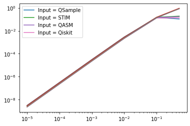
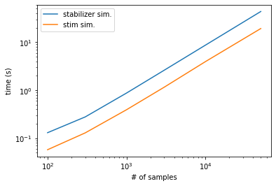

# Input = STIM


<!-- WARNING: THIS FILE WAS AUTOGENERATED! DO NOT EDIT! -->

``` python
import qsample as qs
import qiskit
import time
import stim
import numpy as np
import matplotlib.pyplot as plt
import time
import re
from tqdm.notebook import tqdm
import random
```

``` python
eft = qs.Circuit(noisy=True)
sz_123 = qs.Circuit(noisy=True)
meas7 = qs.Circuit(noisy=False)

eft.from_stim_circuit("""R 0 1 2 3 4 5 6 7
H 0 1 3
                        CNOT 0 4
                        CNOT 1 2
                        TICK
                        CNOT 3 5
                        TICK
                        CNOT 0 6
                        TICK
                        CNOT 3 4
                        TICK
                        CNOT 1 5
                        TICK
                        CNOT 0 2
                        TICK
                        CNOT 5 6
                        TICK
                        CNOT 4 7
                        TICK
                        CNOT 2 7
                        TICK
                        CNOT 5 7
                        M 7""")

sz_123.from_stim_circuit("""R 8
CNOT 0 8
                        TICK
                        CNOT 1 8
                        TICK
                        CNOT 3 8
                        TICK
                        CNOT 6 8
                            M 8""")

meas7.from_stim_circuit("""M 0 1 2 3 4 5 6""")


k1 = 0b0001111
k2 = 0b1010101
k3 = 0b0110011
k12 = k1 ^ k2
k23 = k2 ^ k3
k13 = k1 ^ k3
k123 = k12 ^ k3
stabilizerGenerators = [k1, k2, k3]
stabilizerSet = [0, k1, k2, k3, k12, k23, k13, k123]

def hamming2(x, y):
    count, z = 0, x ^ y
    while z:
        count += 1
        z &= z - 1
    return count

fails = []
def logErr(out):
    global fails
    c = np.array([hamming2(out, i) for i in stabilizerSet])
    d = np.flatnonzero(c <= 1)
    e = np.array([hamming2(out ^ (0b1111111), i) for i in stabilizerSet])
    f = np.flatnonzero(e <= 1)
    if len(d) != 0:
        return False
    elif len(f) != 0:
        fails.append(out)
        return True
    if len(d) != 0 and len(f) != 0: 
        raise('-!-!-CANNOT BE TRUE-!-!-')

def flagged_z_look_up_table_1(z):
    s = [z]

    if s == [1]:
        return True
    else: 
        return False

functions = {"logErr": logErr, "lut": flagged_z_look_up_table_1}

steane0 = qs.Protocol(check_functions=functions, fault_tolerant=True)

steane0.add_nodes_from(['ENC', 'Z2', 'meas'], circuits=[eft, sz_123, meas7])
steane0.add_node('X_COR', circuit=qs.Circuit(noisy=True).from_stim_circuit("""X 6"""))
steane0.add_edge('START', 'ENC', check='True')
steane0.add_edge('ENC', 'meas', check='ENC[-1]==0')
steane0.add_edge('ENC', 'Z2', check='ENC[-1]==1')
steane0.add_edge('Z2', 'X_COR', check='lut(Z2[-1])')
steane0.add_edge('Z2', 'meas', check='not lut(Z2[-1])')
steane0.add_edge('X_COR', 'meas', check='True')
steane0.add_edge('meas', 'FAIL', check='logErr(meas[-1])')
```

``` python
err_model = qs.noise.E1
q = [1e-5, 1e-4, 1e-3, 1e-2, 1e-1, 0.5]
err_params = {'q': q}

begin = time.time()
stim_sam = qs.SubsetSampler(protocol=steane0, simulator=qs.StimSimulator,  p_max={'q': 0.1}, err_model=err_model, err_params=err_params, L=3)
stim_sam.run(2000)
end = time.time()
stim_time = end-begin

v2 = stim_sam.stats()[0]
w2 = stim_sam.stats()[2]
```

    p=('1.00e-01',):   0%|          | 0/2000 [00:00<?, ?it/s]

# Input = qsample

``` python
eft = qs.Circuit([  {"init": {0,1,2,4,3,5,6,7}},
                    {"H": {0,1,3}},
                    {"CNOT": {(0,4)}},
                    {"CNOT": {(1,2)}},
                    {"CNOT": {(3,5)}},
                    {"CNOT": {(0,6)}},
                    {"CNOT": {(3,4)}},
                    {"CNOT": {(1,5)}},
                    {"CNOT": {(0,2)}},
                    {"CNOT": {(5,6)}},
                    {"CNOT": {(4,7)}},
                    {"CNOT": {(2,7)}},
                    {"CNOT": {(5,7)}},
                    {"measure": {7}} ])

sz_123 = qs.Circuit([   {"init": {8}},
                        {"CNOT": {(0,8)}},
                        {"CNOT": {(1,8)}},
                        {"CNOT": {(3,8)}},
                        {"CNOT": {(6,8)}},
                        {"measure": {8}}])

meas7 = qs.Circuit([ {"measure": {0,1,2,3,4,5,6}} ], noisy=False)


k1 = 0b0001111
k2 = 0b1010101
k3 = 0b0110011
k12 = k1 ^ k2
k23 = k2 ^ k3
k13 = k1 ^ k3
k123 = k12 ^ k3
stabilizerGenerators = [k1, k2, k3]
stabilizerSet = [0, k1, k2, k3, k12, k23, k13, k123]

def hamming2(x, y):
    count, z = 0, x ^ y
    while z:
        count += 1
        z &= z - 1
    return count

fails = []

def logErr(out):
    global fails
    
    c = np.array([hamming2(out, i) for i in stabilizerSet])
    d = np.flatnonzero(c <= 1)
    e = np.array([hamming2(out ^ (0b1111111), i) for i in stabilizerSet])
    f = np.flatnonzero(e <= 1)
    if len(d) != 0:
        return False
    elif len(f) != 0:
        fails.append(out)
        return True
    if len(d) != 0 and len(f) != 0: 
        raise('-!-!-CANNOT BE TRUE-!-!-')

def flagged_z_look_up_table_1(z):
    s = [z]

    if s == [1]:
        return True
    else: 
        return False

functions = {"logErr": logErr, "lut": flagged_z_look_up_table_1}

steane0 = qs.Protocol(check_functions=functions, fault_tolerant=True)

steane0.add_nodes_from(['ENC', 'Z2', 'meas'], circuits=[eft, sz_123, meas7])
steane0.add_node('X_COR', circuit=qs.Circuit([{'X': {6}}], noisy=True))
steane0.add_edge('START', 'ENC', check='True')
steane0.add_edge('ENC', 'meas', check='ENC[-1]==0')
steane0.add_edge('ENC', 'Z2', check='ENC[-1]==1')
steane0.add_edge('Z2', 'X_COR', check='lut(Z2[-1])')
steane0.add_edge('Z2', 'meas', check='not lut(Z2[-1])')
steane0.add_edge('X_COR', 'meas', check='True')
steane0.add_edge('meas', 'FAIL', check='logErr(meas[-1])')
```

``` python
err_model = qs.noise.E1
q = [1e-5, 1e-4, 1e-3, 1e-2, 1e-1, 0.5]
err_params = {'q': q}

begin = time.time()
ss_sam = qs.SubsetSampler(protocol=steane0, simulator=qs.StabilizerSimulator,  p_max={'q': 0.1}, err_model=err_model, err_params=err_params, L=3)
ss_sam.run(2000)
end = time.time()
qsample_time = end-begin

v1 = ss_sam.stats()[0]
w1 = ss_sam.stats()[2]
```

    p=('1.00e-01',):   0%|          | 0/2000 [00:00<?, ?it/s]

# Input = QASM

``` python
eft = qs.Circuit().from_qasm_circuit("""OPENQASM 2.0;
include "qelib1.inc";

qreg q[8];
creg c[1];

h q[0];
h q[1];
h q[3];

cx q[0], q[4];
cx q[1], q[2];
cx q[3], q[5];
cx q[0], q[6];
cx q[3], q[4];
cx q[1], q[5];
cx q[0], q[2];
cx q[5], q[6];
cx q[4], q[7];
cx q[2], q[7];
cx q[5], q[7];

measure q[7] -> c[0];""")

sz_123 = qs.Circuit().from_qasm_circuit("""OPENQASM 2.0;
include "qelib1.inc";

qreg q[9];
creg c[1];

// Initialize qubit 8 (default is |0⟩)

// Apply CNOT gates with control qubits 0,1,3,6 and target qubit 8
cx q[0], q[8];
cx q[1], q[8];
cx q[3], q[8];
cx q[6], q[8];

// Measure qubit 8 into classical bit 0
measure q[8] -> c[0];""")

meas7 = qs.Circuit(noisy=False).from_qasm_circuit("""OPENQASM 2.0;
include "qelib1.inc";

qreg q[7];
creg c[7];

measure q[0] -> c[0];
measure q[1] -> c[1];
measure q[2] -> c[2];
measure q[3] -> c[3];
measure q[4] -> c[4];
measure q[5] -> c[5];
measure q[6] -> c[6];""")


k1 = 0b0001111
k2 = 0b1010101
k3 = 0b0110011
k12 = k1 ^ k2
k23 = k2 ^ k3
k13 = k1 ^ k3
k123 = k12 ^ k3
stabilizerGenerators = [k1, k2, k3]
stabilizerSet = [0, k1, k2, k3, k12, k23, k13, k123]

def hamming2(x, y):
    count, z = 0, x ^ y
    while z:
        count += 1
        z &= z - 1
    return count

fails = []

def logErr(out):
    global fails
    
    c = np.array([hamming2(out, i) for i in stabilizerSet])
    d = np.flatnonzero(c <= 1)
    e = np.array([hamming2(out ^ (0b1111111), i) for i in stabilizerSet])
    f = np.flatnonzero(e <= 1)
    if len(d) != 0:
        return False
    elif len(f) != 0:
        fails.append(out)
        return True
    if len(d) != 0 and len(f) != 0: 
        raise('-!-!-CANNOT BE TRUE-!-!-')

def flagged_z_look_up_table_1(z):
    s = [z]

    if s == [1]:
        return True
    else: 
        return False

functions = {"logErr": logErr, "lut": flagged_z_look_up_table_1}

steane0 = qs.Protocol(check_functions=functions, fault_tolerant=True)

steane0.add_nodes_from(['ENC', 'Z2', 'meas'], circuits=[eft, sz_123, meas7])
steane0.add_node('X_COR', circuit=qs.Circuit().from_qasm_circuit("""OPENQASM 2.0;
include "qelib1.inc";

qreg q[8];
x q[6];"""))
steane0.add_edge('START', 'ENC', check='True')
steane0.add_edge('ENC', 'meas', check='ENC[-1]==0')
steane0.add_edge('ENC', 'Z2', check='ENC[-1]==1')
steane0.add_edge('Z2', 'X_COR', check='lut(Z2[-1])')
steane0.add_edge('Z2', 'meas', check='not lut(Z2[-1])')
steane0.add_edge('X_COR', 'meas', check='True')
steane0.add_edge('meas', 'FAIL', check='logErr(meas[-1])')
```

``` python
err_model = qs.noise.E1
q = [1e-5, 1e-4, 1e-3, 1e-2, 1e-1, 0.5]
err_params = {'q': q}

begin = time.time()
ss_sam = qs.SubsetSampler(protocol=steane0, simulator=qs.StimSimulator,  p_max={'q': 0.1}, err_model=err_model, err_params=err_params, L=3)
ss_sam.run(2000)
end = time.time()
stim_time = end-begin

v3 = ss_sam.stats()[0]
w3 = ss_sam.stats()[2]
```

    p=('1.00e-01',):   0%|          | 0/2000 [00:00<?, ?it/s]

# Input = Qiskit

``` python
q = qiskit.QuantumRegister(8)
c = qiskit.ClassicalRegister(1)
eft = qiskit.QuantumCircuit(q, c)

eft.h(q[0])
eft.h(q[1])
eft.h(q[3])


eft.cx(q[0], q[4])
eft.cx(q[1], q[2])
eft.cx(q[3], q[5])
eft.cx(q[0], q[6])
eft.cx(q[3], q[4])
eft.cx(q[1], q[5])
eft.cx(q[0], q[2])
eft.cx(q[5], q[6])
eft.cx(q[4], q[7])
eft.cx(q[2], q[7])
eft.cx(q[5], q[7])

eft.measure(q[7], c[0])

eft = qs.Circuit().from_qiskit_circuit(eft)

# ==========

q = qiskit.QuantumRegister(7)
c = qiskit.ClassicalRegister(7)
meas7 = qiskit.QuantumCircuit(q, c)

meas7.measure(q[0], c[0])
meas7.measure(q[1], c[1])
meas7.measure(q[2], c[2])
meas7.measure(q[3], c[3])
meas7.measure(q[4], c[4])
meas7.measure(q[5], c[5])
meas7.measure(q[6], c[6])


meas7 = qs.Circuit().from_qiskit_circuit(meas7)

# =========
q = qiskit.QuantumRegister(9)
c = qiskit.ClassicalRegister(1)
sz_123 = qiskit.QuantumCircuit(q, c)

sz_123.cx(q[0], q[8])
sz_123.cx(q[1], q[8])
sz_123.cx(q[3], q[8])
sz_123.cx(q[6], q[8])
sz_123.measure(q[8], c[0])


sz_123 = qs.Circuit().from_qiskit_circuit(sz_123)

# ===========


k1 = 0b0001111
k2 = 0b1010101
k3 = 0b0110011
k12 = k1 ^ k2
k23 = k2 ^ k3
k13 = k1 ^ k3
k123 = k12 ^ k3
stabilizerGenerators = [k1, k2, k3]
stabilizerSet = [0, k1, k2, k3, k12, k23, k13, k123]

def hamming2(x, y):
    count, z = 0, x ^ y
    while z:
        count += 1
        z &= z - 1
    return count

fails = []

def logErr(out):
    global fails
    
    c = np.array([hamming2(out, i) for i in stabilizerSet])
    d = np.flatnonzero(c <= 1)
    e = np.array([hamming2(out ^ (0b1111111), i) for i in stabilizerSet])
    f = np.flatnonzero(e <= 1)
    if len(d) != 0:
        return False
    elif len(f) != 0:
        fails.append(out)
        return True
    if len(d) != 0 and len(f) != 0: 
        raise('-!-!-CANNOT BE TRUE-!-!-')

def flagged_z_look_up_table_1(z):
    s = [z]

    if s == [1]:
        return True
    else: 
        return False

functions = {"logErr": logErr, "lut": flagged_z_look_up_table_1}

steane0 = qs.Protocol(check_functions=functions, fault_tolerant=True)

steane0.add_nodes_from(['ENC', 'Z2', 'meas'], circuits=[eft, sz_123, meas7])
steane0.add_node('X_COR', circuit=qs.Circuit().from_qasm_circuit("""OPENQASM 2.0;
include "qelib1.inc";

qreg q[8];
x q[6];"""))
steane0.add_edge('START', 'ENC', check='True')
steane0.add_edge('ENC', 'meas', check='ENC[-1]==0')
steane0.add_edge('ENC', 'Z2', check='ENC[-1]==1')
steane0.add_edge('Z2', 'X_COR', check='lut(Z2[-1])')
steane0.add_edge('Z2', 'meas', check='not lut(Z2[-1])')
steane0.add_edge('X_COR', 'meas', check='True')
steane0.add_edge('meas', 'FAIL', check='logErr(meas[-1])')
```

``` python
err_model = qs.noise.E1
q = [1e-5, 1e-4, 1e-3, 1e-2, 1e-1, 0.5]
err_params = {'q': q}

begin = time.time()
ss_sam = qs.SubsetSampler(protocol=steane0, simulator=qs.StimSimulator,  p_max={'q': 0.1}, err_model=err_model, err_params=err_params, L=3)
ss_sam.run(2000)
end = time.time()
stim_time = end-begin

v4 = ss_sam.stats()[0]
w4 = ss_sam.stats()[2]
```

    p=('1.00e-01',):   0%|          | 0/2000 [00:00<?, ?it/s]

``` python
plt.plot(q, v1, label = "Input = QSample")
plt.plot(q, w1)
plt.plot(q, v2, label = "Input = STIM")
plt.plot(q, w2)
plt.plot(q, v3, label = "Input = QASM")
plt.plot(q, w3)
plt.plot(q, v4, label = "Input = Qiskit")
plt.plot(q, w4)

plt.xscale('log')
plt.yscale('log')
plt.legend()

print(qsample_time)
print(stim_time)
```

    1.8705940246582031
    0.95461106300354



``` python
"""
qsample_times = []
stim_times = []

samples = [100, 300, 1000, 3000, 10000, 50000]

for s in samples:
    begin = time.time()
    stim_sam = qs.SubsetSampler(protocol=steane0, simulator=qs.StabilizerSimulator,  p_max={'q': 0.1}, err_model=err_model, err_params=err_params, L=3)
    stim_sam.run(s)
    end = time.time()
    qsample_times.append(end-begin)

    begin = time.time()
    ss_sam = qs.SubsetSampler(protocol=steane0, simulator=qs.StimSimulator,  p_max={'q': 0.01}, err_model=err_model, err_params=err_params, L=3)
    ss_sam.run(s)
    end = time.time()
    stim_times.append(end-begin)

plt.plot(samples, stim_sam.stats()[0])
plt.plot(samples, stim_sam.stats()[2])
plt.plot(samples, ss_sam.stats()[0])
plt.plot(samples, ss_sam.stats()[2])
plt.xscale('log')
plt.yscale('log')
"""
```

    p=('1.00e-01',):   0%|          | 0/100 [00:00<?, ?it/s]

    p=('1.00e-02',):   0%|          | 0/100 [00:00<?, ?it/s]

    p=('1.00e-01',):   0%|          | 0/300 [00:00<?, ?it/s]

    p=('1.00e-02',):   0%|          | 0/300 [00:00<?, ?it/s]

    p=('1.00e-01',):   0%|          | 0/1000 [00:00<?, ?it/s]

    p=('1.00e-02',):   0%|          | 0/1000 [00:00<?, ?it/s]

    p=('1.00e-01',):   0%|          | 0/3000 [00:00<?, ?it/s]

    p=('1.00e-02',):   0%|          | 0/3000 [00:00<?, ?it/s]

    KeyboardInterrupt: 
    ---------------------------------------------------------------------------
    KeyboardInterrupt                         Traceback (most recent call last)
    Input In [11], in <cell line: 6>()
         13 begin = time.time()
         14 ss_sam = qs.SubsetSampler(protocol=steane0, simulator=qs.StimSimulator,  p_max={'q': 0.01}, err_model=err_model, err_params=err_params, L=3)
    ---> 15 ss_sam.run(s)
         16 end = time.time()
         17 stim_times.append(end-begin)

    File ~/Desktop/qsample/qsample/sampler/subset.py:138, in SubsetSampler.run(self, n_shots, callbacks)
        135 self.stop_sampling = False # Flag can be controlled in callbacks
        136 callbacks.on_sampler_begin()
    --> 138 for _ in tqdm(range(n_shots), desc=f"p={tuple(map('{:.2e}'.format, self.p_max))}"):
        139     tableau = None
        140     callbacks.on_protocol_begin()

    File /opt/anaconda3/lib/python3.9/site-packages/tqdm/notebook.py:258, in tqdm_notebook.__iter__(self)
        256 try:
        257     it = super(tqdm_notebook, self).__iter__()
    --> 258     for obj in it:
        259         # return super(tqdm...) will not catch exception
        260         yield obj
        261 # NB: except ... [ as ...] breaks IPython async KeyboardInterrupt

    File /opt/anaconda3/lib/python3.9/site-packages/tqdm/std.py:1210, in tqdm.__iter__(self)
       1208 finally:
       1209     self.n = n
    -> 1210     self.close()

    File /opt/anaconda3/lib/python3.9/site-packages/tqdm/notebook.py:290, in tqdm_notebook.close(self)
        288 else:
        289     if self.leave:
    --> 290         self.disp(bar_style='success', check_delay=False)
        291     else:
        292         self.disp(close=True, check_delay=False)

    File /opt/anaconda3/lib/python3.9/site-packages/tqdm/notebook.py:177, in tqdm_notebook.display(self, msg, pos, close, bar_style, check_delay)
        174     left, right = '', escape(msg)
        176 # Update description
    --> 177 ltext.value = left
        178 # never clear the bar (signal: msg='')
        179 if right:

    File /opt/anaconda3/lib/python3.9/site-packages/traitlets/traitlets.py:606, in TraitType.__set__(self, obj, value)
        604     raise TraitError('The "%s" trait is read-only.' % self.name)
        605 else:
    --> 606     self.set(obj, value)

    File /opt/anaconda3/lib/python3.9/site-packages/traitlets/traitlets.py:595, in TraitType.set(self, obj, value)
        591     silent = False
        592 if silent is not True:
        593     # we explicitly compare silent to True just in case the equality
        594     # comparison above returns something other than True/False
    --> 595     obj._notify_trait(self.name, old_value, new_value)

    File /opt/anaconda3/lib/python3.9/site-packages/traitlets/traitlets.py:1219, in HasTraits._notify_trait(self, name, old_value, new_value)
       1218 def _notify_trait(self, name, old_value, new_value):
    -> 1219     self.notify_change(Bunch(
       1220         name=name,
       1221         old=old_value,
       1222         new=new_value,
       1223         owner=self,
       1224         type='change',
       1225     ))

    File /opt/anaconda3/lib/python3.9/site-packages/ipywidgets/widgets/widget.py:605, in Widget.notify_change(self, change)
        601 if self.comm is not None and self.comm.kernel is not None:
        602     # Make sure this isn't information that the front-end just sent us.
        603     if name in self.keys and self._should_send_property(name, getattr(self, name)):
        604         # Send new state to front-end
    --> 605         self.send_state(key=name)
        606 super(Widget, self).notify_change(change)

    File /opt/anaconda3/lib/python3.9/site-packages/ipywidgets/widgets/widget.py:489, in Widget.send_state(self, key)
        487 state, buffer_paths, buffers = _remove_buffers(state)
        488 msg = {'method': 'update', 'state': state, 'buffer_paths': buffer_paths}
    --> 489 self._send(msg, buffers=buffers)

    File /opt/anaconda3/lib/python3.9/site-packages/ipywidgets/widgets/widget.py:737, in Widget._send(self, msg, buffers)
        735 """Sends a message to the model in the front-end."""
        736 if self.comm is not None and self.comm.kernel is not None:
    --> 737     self.comm.send(data=msg, buffers=buffers)

    File /opt/anaconda3/lib/python3.9/site-packages/ipykernel/comm/comm.py:122, in Comm.send(self, data, metadata, buffers)
        120 def send(self, data=None, metadata=None, buffers=None):
        121     """Send a message to the frontend-side version of this comm"""
    --> 122     self._publish_msg('comm_msg',
        123         data=data, metadata=metadata, buffers=buffers,
        124     )

    File /opt/anaconda3/lib/python3.9/site-packages/ipykernel/comm/comm.py:66, in Comm._publish_msg(self, msg_type, data, metadata, buffers, **keys)
         64 metadata = {} if metadata is None else metadata
         65 content = json_clean(dict(data=data, comm_id=self.comm_id, **keys))
    ---> 66 self.kernel.session.send(self.kernel.iopub_socket, msg_type,
         67     content,
         68     metadata=json_clean(metadata),
         69     parent=self.kernel.get_parent("shell"),
         70     ident=self.topic,
         71     buffers=buffers,
         72 )

    File /opt/anaconda3/lib/python3.9/site-packages/jupyter_client/session.py:717, in Session.send(self, stream, msg_or_type, content, parent, ident, buffers, track, header, metadata)
        715     buffers = buffers or msg.get('buffers', [])
        716 else:
    --> 717     msg = self.msg(msg_or_type, content=content, parent=parent,
        718                    header=header, metadata=metadata)
        719 if self.check_pid and not os.getpid() == self.pid:
        720     get_logger().warning("WARNING: attempted to send message from fork\n%s",
        721         msg
        722     )

    File /opt/anaconda3/lib/python3.9/site-packages/jupyter_client/session.py:577, in Session.msg(self, msg_type, content, parent, header, metadata)
        570 """Return the nested message dict.
        571 
        572 This format is different from what is sent over the wire. The
        573 serialize/deserialize methods converts this nested message dict to the wire
        574 format, which is a list of message parts.
        575 """
        576 msg = {}
    --> 577 header = self.msg_header(msg_type) if header is None else header
        578 msg['header'] = header
        579 msg['msg_id'] = header['msg_id']

    File /opt/anaconda3/lib/python3.9/site-packages/jupyter_client/session.py:567, in Session.msg_header(self, msg_type)
        566 def msg_header(self, msg_type):
    --> 567     return msg_header(self.msg_id, msg_type, self.username, self.session)

    File /opt/anaconda3/lib/python3.9/site-packages/jupyter_client/session.py:220, in msg_header(msg_id, msg_type, username, session)
        218 def msg_header(msg_id, msg_type, username, session):
        219     """Create a new message header"""
    --> 220     date = utcnow()
        221     version = protocol_version
        222     return locals()

    File /opt/anaconda3/lib/python3.9/site-packages/jupyter_client/session.py:151, in utcnow()
        149 def utcnow():
        150     """Return timezone-aware UTC timestamp"""
    --> 151     return datetime.utcnow().replace(tzinfo=utc)

    KeyboardInterrupt: 

``` python
plt.plot(samples, qsample_times, label = 'stabilizer sim.')
plt.plot(samples, stim_times, label = 'stim sim.')
plt.legend()
plt.xscale('log')
plt.yscale('log')
plt.ylabel('time (s)')
plt.xlabel('# of samples')

print('Average ratio of stim time/stabilizer time: {:.2f}'.format(np.average(np.array(stim_times)/np.array(qsample_times))))
```

    Average ratio of stim time/stabilizer time: 0.45


