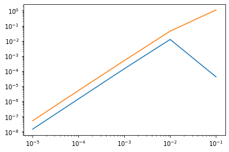
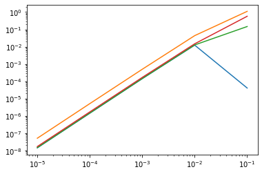

# Surface code


<!-- WARNING: THIS FILE WAS AUTOGENERATED! DO NOT EDIT! -->

``` python
#export
import qsample as qs
import qiskit
import time
import stim
import numpy as np
import matplotlib.pyplot as plt
import time
import re
from tqdm.notebook import tqdm
import pymatching
```

# 

# 

# 

# 

# 

# 

# 

# 

# 

# 

# 

# 

``` python
#export
circuit = stim.Circuit.generated("surface_code:rotated_memory_x", rounds=1, distance=3)
circuit.diagram("timeline-svg")

"""
IMPORTANT NOTE: The predictions output by pyMatching depend on the error rate of the STIM circuit,
but the prediction error is nearly independent of the error rate if it is sufficient low (which is the
regime we care about in QSample anyway), so in order to generate the first detector error model and 
Matching object, it is advisable to use a physical error rate by the lower end of your range.

"""

circuit = stim.Circuit.generated("surface_code:rotated_memory_x", rounds=1, distance=3, after_clifford_depolarization=0.05,
    after_reset_flip_probability=0.001,
    before_measure_flip_probability=0.001,
    before_round_data_depolarization=0.001,)
surface_code = qs.Circuit(noisy=True).from_stim_circuit(circuit)

matching = pymatching.Matching(surface_code.dem)
num_detectors = matching.num_detectors
detector_array = surface_code.detector_array


corr = qs.Circuit(noisy=False).from_stim_circuit("""X 1 8 15""")
meas = qs.Circuit(noisy=False).from_stim_circuit("""M 1 8 15""")

round_ = 0
def reset_count():
    global round_
    round_=0
    return True

def increase_count():
    global round_
    round_+=1
    return round_

def count():
    global round_
    return round_

def int2meas(out):
    result = []
    for i in np.arange(surface_code.n_measurements)[::-1]:
        result.append(out//(2**i))
        out-=result[-1]*2**i
    return result

def measurement2detector(out, detector_array):
    out = int2meas(out[-1])
    detection_events = np.zeros(num_detectors)
    for ii in range(num_detectors):
        event = 0
        for jj in detector_array[ii]:
            event^=int(out[jj])
        detection_events[ii]=event
    return detection_events
    
def decoder(out):
    detection_events = measurement2detector(out, detector_array)
    result = matching.decode(detection_events)
    return result

def logErr(out):
    return out[0] in [1, 2, 4, 7]

functions = {'decoder': decoder, 'matching':matching, 'logErr':logErr,
            'reset_count': reset_count, 'count': count, 'increase_count': increase_count}
surface = qs.Protocol(check_functions=functions)


n_rounds = 4
surface.add_nodes_from(['SC', 'corr', 'meas'], circuits=[surface_code, corr, meas])
surface.add_node('Round_counter', circuit=qs.Circuit([{"I": {0}}],noisy=False))
surface.add_edge('START', 'Round_counter', check='reset_count()')
surface.add_edge('Round_counter', 'SC', check='increase_count()')
surface.add_edge('SC', 'corr', check='decoder(SC)')
surface.add_edge('SC', 'Round_counter', check=f'(not decoder(SC)) and count()<{n_rounds}')
surface.add_edge('SC', 'meas', check=f'(not decoder(SC)) and count()=={n_rounds}')
surface.add_edge('corr', 'Round_counter', check=f'count()<{n_rounds}')
surface.add_edge('corr', 'meas', check=f'count()=={n_rounds}')
surface.add_edge('meas', 'FAIL', check='logErr(meas)')
```

``` python
#export
err_model = qs.noise.E1
q = [1e-5, 1e-4, 1e-3, 1e-2, 1e-1]
err_params = {'q': q}

begin = time.time()
ss_sam = qs.SubsetSampler(protocol=surface, simulator=qs.StimSimulator,  p_max={'q': 0.01}, err_model=err_model, err_params=err_params, L=5)
ss_sam.run(25000)
end = time.time()
qsample_time = end-begin

v1 = ss_sam.stats()[0]
w1 = ss_sam.stats()[2]

plt.plot(q, v1)
plt.plot(q, w1)
plt.xscale('log')
plt.yscale('log')
print('time:', qsample_time, 's')
```

    p=('1.00e-02',):   0%|          | 0/25000 [00:00<?, ?it/s]

    time: 53.046889781951904 s

    /Users/jhfontes/Desktop/qsample/qsample/sampler/subset.py:92: RuntimeWarning: invalid value encountered in sqrt
      return np.broadcast_arrays(p_L, np.sqrt(var), p_L+delta, np.sqrt(var_up))



``` python
"""
IMPORTANT NOTE: The predictions output by pyMatching depend on the error rate of the STIM circuit,
but the prediction error is nearly independent of the error rate if it is sufficient low (which is the
regime we care about in QSample anyway), so in order to generate the first detector error model and 
Matching object, it is advisable to use a physical error rate by the lower end of your range.
"""

circuit = stim.Circuit.generated("surface_code:rotated_memory_x", rounds=1, distance=3, after_clifford_depolarization=0.05,
    after_reset_flip_probability=0.001,
    before_measure_flip_probability=0.001,
    before_round_data_depolarization=0.001,)
surface_code = qs.Circuit(noisy=True).from_stim_circuit(circuit)

matching = pymatching.Matching(surface_code.dem)
num_detectors = matching.num_detectors
detector_array = surface_code.detector_array


corr = qs.Circuit(noisy=False).from_stim_circuit("""X 1 8 15""")
meas = qs.Circuit(noisy=False).from_stim_circuit("""M 1 8 15""")

round_ = 0
def reset_count():
    global round_
    round_=0
    return True

def increase_count():
    global round_
    round_+=1
    return round_

def count():
    global round_
    return round_

def int2meas(out):
    result = []
    for i in np.arange(surface_code.n_measurements)[::-1]:
        result.append(out//(2**i))
        out-=result[-1]*2**i
    return result

def measurement2detector(out, detector_array):
    out = int2meas(out[-1])
    detection_events = np.zeros(num_detectors)
    for ii in range(num_detectors):
        event = 0
        for jj in detector_array[ii]:
            event^=int(out[jj])
        detection_events[ii]=event
    return detection_events
    
def decoder(out):
    detection_events = measurement2detector(out, detector_array)
    result = matching.decode(detection_events)
    return result

def logErr(out):
    return out[0] in [1, 2, 4, 7]

functions = {'decoder': decoder, 'matching':matching, 'logErr':logErr,
            'reset_count': reset_count, 'count': count, 'increase_count': increase_count}
surface = qs.Protocol(check_functions=functions)


n_rounds = 1
surface.add_nodes_from(['SC', 'corr', 'meas'], circuits=[surface_code, corr, meas])
surface.add_node('Round_counter', circuit=qs.Circuit([{"I": {0}}],noisy=False))
surface.add_edge('START', 'Round_counter', check='reset_count()')
surface.add_edge('Round_counter', 'SC', check='increase_count()')
surface.add_edge('SC', 'corr', check='decoder(SC)')
surface.add_edge('SC', 'Round_counter', check=f'(not decoder(SC)) and count()<{n_rounds}')
surface.add_edge('SC', 'meas', check=f'(not decoder(SC)) and count()=={n_rounds}')
surface.add_edge('corr', 'Round_counter', check=f'count()<{n_rounds}')
surface.add_edge('corr', 'meas', check=f'count()=={n_rounds}')
surface.add_edge('meas', 'FAIL', check='logErr(meas)')
```

``` python
err_model = qs.noise.E1
q = [1e-5, 1e-4, 1e-3, 1e-2, 1e-1]
err_params = {'q': q}

begin = time.time()
ss_sam = qs.SubsetSampler(protocol=surface, simulator=qs.StimSimulator,  p_max={'q': 0.01}, err_model=err_model, err_params=err_params, L=5)
ss_sam.run(25000)
end = time.time()
qsample_time = end-begin

v1b = ss_sam.stats()[0]
w1b = ss_sam.stats()[2]

plt.plot(q, v1)
plt.plot(q, w1)
plt.plot(q, v1b)
plt.plot(q, w1b)
plt.xscale('log')
plt.yscale('log')
print('time:', qsample_time, 's')
```

    p=('1.00e-02',):   0%|          | 0/25000 [00:00<?, ?it/s]

    /Users/jhfontes/Desktop/qsample/qsample/sampler/subset.py:92: RuntimeWarning: invalid value encountered in sqrt
      return np.broadcast_arrays(p_L, np.sqrt(var), p_L+delta, np.sqrt(var_up))

    time: 14.701840162277222 s



``` python
"""
IMPORTANT NOTE: The predictions output by pyMatching depend on the error rate of the STIM circuit,
but the prediction error is nearly independent of the error rate if it is sufficient low (which is the
regime we care about in QSample anyway), so in order to generate the first detector error model and 
Matching object, it is advisable to use a physical error rate by the lower end of your range.
"""

circuit = stim.Circuit.generated("surface_code:rotated_memory_x", rounds=1, distance=3, after_clifford_depolarization=0.05,
    after_reset_flip_probability=0.001,
    before_measure_flip_probability=0.001,
    before_round_data_depolarization=0.001,)
surface_code = qs.Circuit(noisy=True).from_stim_circuit(circuit)

matching = pymatching.Matching(surface_code.dem)
num_detectors = matching.num_detectors
detector_array = surface_code.detector_array


corr = qs.Circuit(noisy=False).from_stim_circuit("""X 1 8 15""")
meas = qs.Circuit(noisy=False).from_stim_circuit("""M 1 8 15""")

round_ = 0
def reset_count():
    global round_
    round_=0
    return True

def increase_count():
    global round_
    round_+=1
    return round_

def count():
    global round_
    return round_

def int2meas(out):
    result = []
    for i in np.arange(surface_code.n_measurements)[::-1]:
        result.append(out//(2**i))
        out-=result[-1]*2**i
    return result

def measurement2detector(out, detector_array):
    out = int2meas(out[-1])
    detection_events = np.zeros(num_detectors)
    for ii in range(num_detectors):
        event = 0
        for jj in detector_array[ii]:
            event^=int(out[jj])
        detection_events[ii]=event
    return detection_events
    
def decoder(out):
    detection_events = measurement2detector(out, detector_array)
    result = matching.decode(detection_events)
    return result

def logErr(out):
    return out[0] in [1, 2, 4, 7]

functions = {'decoder': decoder, 'matching':matching, 'logErr':logErr,
            'reset_count': reset_count, 'count': count, 'increase_count': increase_count}
surface = qs.Protocol(check_functions=functions)


n_rounds = 8
surface.add_nodes_from(['SC', 'corr', 'meas'], circuits=[surface_code, corr, meas])
surface.add_node('Round_counter', circuit=qs.Circuit([{"I": {0}}],noisy=False))
surface.add_edge('START', 'Round_counter', check='reset_count()')
surface.add_edge('Round_counter', 'SC', check='increase_count()')
surface.add_edge('SC', 'corr', check='decoder(SC)')
surface.add_edge('SC', 'Round_counter', check=f'(not decoder(SC)) and count()<{n_rounds}')
surface.add_edge('SC', 'meas', check=f'(not decoder(SC)) and count()=={n_rounds}')
surface.add_edge('corr', 'Round_counter', check=f'count()<{n_rounds}')
surface.add_edge('corr', 'meas', check=f'count()=={n_rounds}')
surface.add_edge('meas', 'FAIL', check='logErr(meas)')
```

``` python
"""RUNTIME > 20 min

err_model = qs.noise.E1
q = [1e-5, 1e-4, 1e-3, 1e-2, 1e-1]
err_params = {'q': q}

begin = time.time()
ss_sam = qs.SubsetSampler(protocol=surface, simulator=qs.StimSimulator,  p_max={'q': 0.01}, err_model=err_model, err_params=err_params, L=5)
ss_sam.run(25000)
end = time.time()
qsample_time = end-begin

v1 = ss_sam.stats()[0]
w1 = ss_sam.stats()[2]

plt.plot(q, v1)
plt.plot(q, w1)
plt.xscale('log')
plt.yscale('log')
print('time:', qsample_time, 's')
"""
```

    p=('1.00e-02',):   0%|          | 0/25000 [00:00<?, ?it/s]

    KeyboardInterrupt: 
    ---------------------------------------------------------------------------
    KeyboardInterrupt                         Traceback (most recent call last)
    Cell In[12], line 13
         10 end = time.time()
         11 qsample_time = end-begin
    ---> 13 v1 = ss_sam.stats()[0]
         14 w1 = ss_sam.stats()[2]
         16 plt.plot(q, v1)

    File ~/Desktop/qsample/qsample/sampler/subset.py:89, in SubsetSampler.stats(self, err_params)
         87 delta = self.tree.delta
         88 var = self.tree.var(mode=1)
    ---> 89 var_up = self.tree.var(mode=0)
         91 self.tree.constants = _constants
         92 return np.broadcast_arrays(p_L, np.sqrt(var), p_L+delta, np.sqrt(var_up))

    File ~/Desktop/qsample/qsample/sampler/tree.py:532, in Tree.var(self, mode)
        530 for leaf in leaves: # path variances
        531     if self.path_weight(leaf) >= 1: # exclude weight-0 paths
    --> 532         acc += self.path_var(leaf)
        535 # Add contributions to variance from no-fail paths
        536 nf_leaves = set(n for n in leaf_set.difference(self.marked) if isinstance(n,Variable) and not n.invariant and len(n.siblings)==0)

    File ~/Desktop/qsample/qsample/sampler/tree.py:460, in Tree.path_var(self, node, zero_leaf)
        458     v = self.value(n)**2
        459     if zero_leaf and n == node: v = 0
    --> 460     E2 *= v
        461     VpE2 *= (n.var + v) if isinstance(n,Variable) else v
        463 return VpE2 - E2

    KeyboardInterrupt: 
